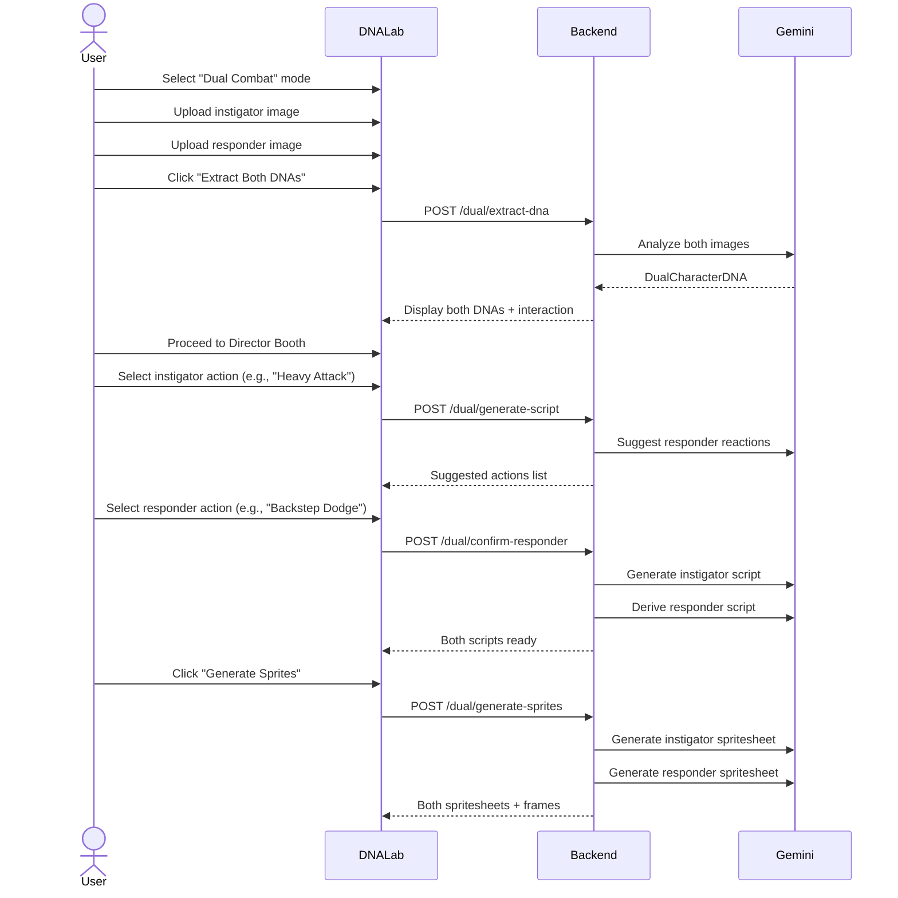

# SpriteMancer AI - Dual Character Animation System

> **Comprehensive documentation for the two-character relational animation pipeline**

---

## 1. Overview

The **Dual System** extends SpriteMancer's single-character pipeline to generate synchronized animations for **two characters interacting** (e.g., attack/reaction, cast/dodge sequences). It enforces **temporal causality**: the responder's animation is always *derived* from and *bound to* the instigator's timeline.

### Key Concepts

| Term | Definition |
|------|------------|
| **Instigator** | The character initiating the action (attacker, caster) |
| **Responder** | The character reacting to the action (defender, target) |
| **Temporal Binding** | Responder frames are synchronized to instigator's impact windows |
| **Interaction Constraints** | Physics-based rules governing how characters can interact |

---

## 2. Architecture

### Pipeline Comparison

```mermaid
graph TB
    subgraph "Single Mode"
        S1[Stage 1: DNA Extraction]
        S3[Stage 3: Frame Budget]
        S5[Stage 5: Biomech Script]
        S6[Stage 6: Image Gen]
        S7[Stage 7: Post-Process]
        S1 --> S3 --> S5 --> S6 --> S7
    end
    
    subgraph "Dual Mode"
        D1[Stage 1b: Dual DNA]
        D3[Stage 3: Instigator Budget]
        D4[Stage 4: Responder Suggestion]
        D6[Stage 6: Instigator Script]
        D7[Stage 7: Responder Script]
        D8[Stage 8: Instigator Sprites]
        D9[Stage 9: Responder Sprites]
        D10[Stage 10: Post-Process]
        D1 --> D3 --> D4 --> D6 --> D7 --> D8 --> D9 --> D10
    end
```



### Dual Pipeline Stages

| Stage | Name | Description |
|-------|------|-------------|
| **1b** | Dual DNA Extraction | Analyzes both images, extracts DNA + interaction constraints |
| **3** | Instigator Action Definition | Computes frame budget for the attacking character |
| **4** | Responder Action Suggestion | AI suggests plausible reactions (dodge, block, hit) |
| **6** | Instigator Script | PRIMARY timeline - drives the entire animation |
| **7** | Responder Script | DERIVED timeline - bound to instigator's impact windows |
| **8** | Instigator Image Gen | Generate instigator spritesheet via Gemini |
| **9** | Responder Image Gen | Generate responder spritesheet via Gemini |
| **10** | Post-Processing | Extract frames from both spritesheets |

---

## 3. Data Models

### DualCharacterDNA

```python
class DualCharacterDNA(BaseModel):
    instigator: CharacterDNA  # Attacker DNA
    responder: CharacterDNA   # Reactor DNA
    interaction: InteractionConstraints
```

### InteractionConstraints

Physics-based rules computed by analyzing both characters:

```python
class InteractionConstraints(BaseModel):
    reach_advantage: Literal["A", "B", "equal"]  # Who has longer range
    speed_advantage: Literal["A", "B", "equal"]  # Who is faster
    mass_ratio: float  # Instigator mass / Responder mass
    likely_responses: list[str]  # ["dodge", "block", "partial_hit", "full_hit"]
```

### ResponderSuggestion

```python
class ResponderSuggestion(BaseModel):
    action: str         # e.g., "Backstep Dodge", "Staggered Hit"
    reason: str         # Physics/biomechanics explanation
    recommended: bool   # AI's top pick
```

---

## 4. Temporal Binding Rules

The responder script is **never independent** - it's derived from the instigator's timeline.

### Phase Mapping

| Instigator Phase | Responder Phase (Hit) | Responder Phase (Dodge) |
|------------------|----------------------|-------------------------|
| Anticipation | Ready/Anticipation | React/Prepare |
| Contact (impact_window) | Impact Received | Evade Action |
| Follow-through | Stagger/Knockback | Recovery |
| Recovery | Recovery | Return to Ready |

### Validation Rules

1. **Frame Count Match**: Responder MUST have exactly the same number of frames as instigator
2. **No Early Reaction**: Responder cannot be in Contact/Recovery phase before instigator's first Contact frame
3. **Impact Window Alignment**: `impact_window: true` in responder marks when they RECEIVE the hit

---

## 5. API Endpoints

### Dual Pipeline Endpoints

```
POST /api/pipeline/dual/generate-script
├── Input: { project_id, action_type, difficulty_tier, perspective }
├── Runs: Stages 1b, 3, 4
└── Returns: { instigator_dna, responder_dna, interaction, suggested_responder_actions }

POST /api/pipeline/dual/confirm-responder
├── Input: { project_id, responder_action }
├── Runs: Stages 6, 7
└── Returns: { instigator_script, responder_script, frame_count }

POST /api/pipeline/dual/generate-sprites
├── Input: { project_id, action_type, difficulty_tier, perspective }
├── Runs: Stages 8, 9, 10
└── Returns: { instigator: {...}, responder: {...} }

GET /api/pipeline/dual/{project_id}/status
└── Returns: { is_dual, has_*_dna, has_*_script, has_*_frames }
```

---

## 6. User Flow



---

## 7. Backend Implementation

### Key Files

| File | Purpose |
|------|---------|
| `stage_1b_dual_dna.py` | Dual DNA extraction |
| `stage_2b_responder_action.py` | Responder action suggestion |
| `stage_5b_responder_script.py` | Temporally-bound script derivation |
| `dual_pipeline_orchestrator.py` | Main orchestrator with 10 stages |
| `dual_character_dna.py` | Pydantic models |

### Prompts

| Prompt File | Stage |
|-------------|-------|
| `stage_1b_dual_dna.txt` | Dual DNA extraction |
| `stage_2b_responder_action.txt` | Responder suggestion |
| `stage_5b_responder_script.txt` | Responder script derivation |

---

## 8. Frontend Integration

### TypeScript Types

```typescript
type GenerationMode = "single" | "dual";

interface DualCharacterDNA {
    instigator: CharacterDNA;
    responder: CharacterDNA;
    interaction: InteractionConstraints;
}

interface DualAnimationFrame extends AnimationFrame {
    impact_window?: boolean;
    force_vector?: string | null;
}

interface DualPipelineStatus {
    is_dual: boolean;
    has_instigator_dna: boolean;
    has_responder_dna: boolean;
    has_instigator_script: boolean;
    has_responder_script: boolean;
    has_instigator_frames: boolean;
    has_responder_frames: boolean;
}
```

### API Client Methods

```typescript
// Extract DNA for both characters
api.extractDualDNA(projectId, instigatorImage, responderImage)

// Generate scripts (returns suggestions)
api.generateDualScript(projectId, actionType, difficultyTier, perspective)

// Confirm responder action choice
api.confirmResponderAction(projectId, responderAction)

// Generate sprites for both characters
api.generateDualSprites(projectId, actionType, difficultyTier, perspective)

// Check pipeline status
api.getDualPipelineStatus(projectId)
```

---

## 9. Database Schema

### Project Table (dual-mode fields)

| Column | Type | Description |
|--------|------|-------------|
| `generation_mode` | `text` | "single" or "dual" |
| `responder_reference_url` | `text` | Second character's image URL |
| `responder_dna` | `jsonb` | Responder's CharacterDNA |
| `interaction_constraints` | `jsonb` | Physics constraints |
| `responder_animation_script` | `jsonb` | Responder's derived script |
| `responder_spritesheet_url` | `text` | Responder spritesheet URL |
| `responder_frame_urls` | `text[]` | Array of responder frame URLs |

---

## 10. Best Practices

### Choosing Responder Actions

| Instigator Action | Good Responder Choices |
|-------------------|------------------------|
| Light Attack | Backstep Dodge, Partial Block |
| Heavy Attack | Staggered Hit, Full Impact |
| Combo | Rolling Dodge, Counter Attack |
| Cast/Spell | Interrupt, Full Hit, Evade |

### Performance Considerations

1. **Dual DNA extraction** is a single Gemini call with both images
2. **Script generation** requires two sequential calls (instigator → responder)
3. **Sprite generation** can be parallelized (but currently sequential)
4. **Frame counts are identical** for both characters to maintain sync

---

## 11. Error Handling

| Error | Cause | Resolution |
|-------|-------|------------|
| "No responder reference image" | Missing second image | Upload responder image in DNA Lab |
| "Frame count mismatch" | Script generation bug | Regenerate responder script |
| "Temporal causality violation" | Responder reacts too early | Warning logged, script proceeds |
| "Project is not in dual mode" | Wrong endpoint called | Check `generation_mode` field |

---

## 12. Future Enhancements

- [ ] **Multi-responder mode**: One instigator vs multiple responders
- [ ] **Counter attacks**: Responder can become instigator mid-animation
- [ ] **Parallel sprite generation**: Generate both spritesheets simultaneously
- [ ] **Interactive frame alignment**: Manual adjustment of temporal binding
- [ ] **Combo chaining**: Link multiple action sequences together
